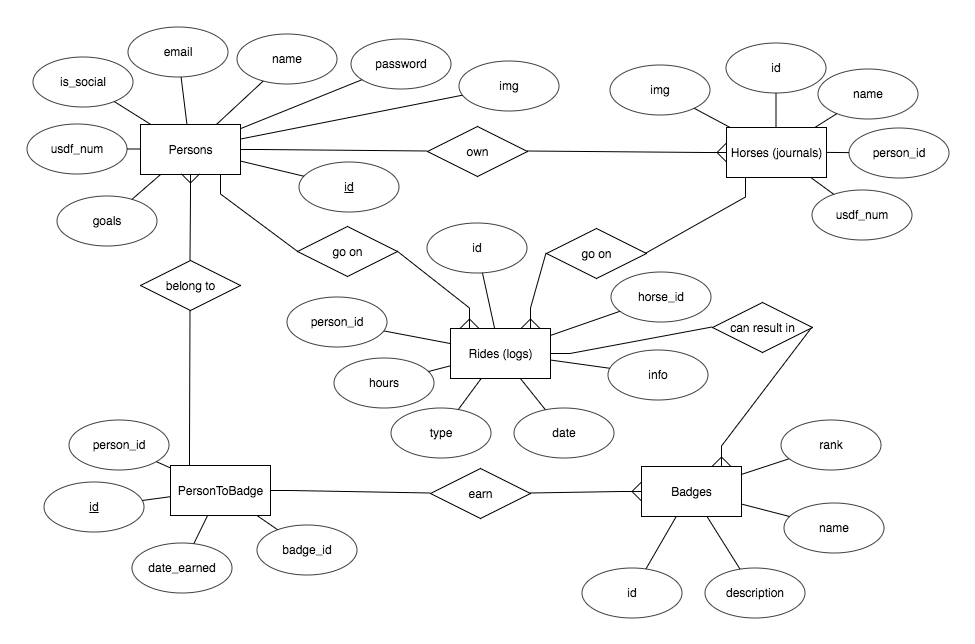
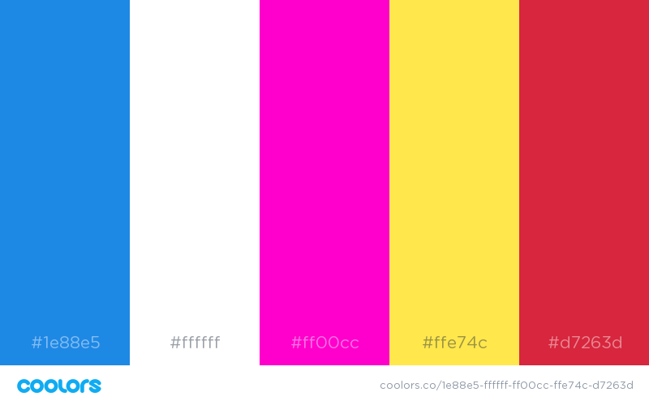

# hart / MyJournal

Live version accessible at http://myjournal.benjamindejes.us

## Introduction
MyJournal is a prototype framework of an existing journaling product I created for the United States Dressage Foundation. The Horse and Rider Together Program, fondly referred to as HART, allows horse enthusiasts to manage horse data, track riding details, and earn badges based on the number of hours spent in the saddle.

While HART is aimed primarily for equestrians, MyJournal takes the existing models and controls, and applies new views to appeal to a greater audience and serve a more utilitarian purpose. I hope you enjoy it!

## Approach Taken and Planning Phase

I started by sketching and creating an ERDM for my database
The framework sketches gave me an idea of user flow and routes that would need created
As the routes developed, I applied iterative testing to see what kinds of user inputs and form submissions would cause the application to break.  Bcrypt, Sanitize and Validate nodes were installed to handle SQL injection attacks.
  
Once the routes and forms were created, next came styling.  I wanted a colorful background and accents with minimal user interface.  A bold palette was chosen complimented by the tranquil video background.  When possible I accounted for accessibility issues by using labels and appropriate class and ID tags.  Additional Javascript and jQuery functionality was added to make navigation and form completion more seamless.  I relied on the convenience of buttons and CSS animations to enchance user experience.

With styling complete, I then spent a large portion of time working with the Google Graphs API.  The hardest part was modifying the model data to meet the Google Graph API needs.  I look forward to playing more with Google Graphs to create more visual data.

## Technologies Used
- HTML/CSS/SASS
- POSTGRESQL/PSQL
- Javascript
- jQuery
- node.js
- express.js
- moment.js - date formatting
- validator - email validation
- bcrypt - hashed passwords
- express-session - user cookies
- express-sanitizer - for text input
- materialize - front-end framework
- color pallette: https://coolors.co/1e88e5-ffffff-ff00cc-ffe74c-d7263d   
- magic-css - animations

- API google charts: https://google-developers.appspot.com/chart/

## Unsolved Problems
One beneficial experience I had from this project was the use of frameworks and planning.  I established a strict timeline of what functionality needed to completed at certain points to finish the project.  My approach was to build HTML forms and Express routes first, then style accordingly.  I fought with Materialize and the Google API for a long time, and knew that to get an MVP I would have to sacrifice some functinality of the journal.  The badges model, while created, was not fully integrated.  The model also allows for logs to have a sub-category for further classification and categorization.  While the features are not live in this version, the foundation is laid for them to be created.

## Sources Cited
Background Video:
https://videos.pexels.com/videos/person-relaxes-at-a-lake-2881
css: http://thenewcode.com/777/Create-Fullscreen-HTML5-Page-Background-Video

